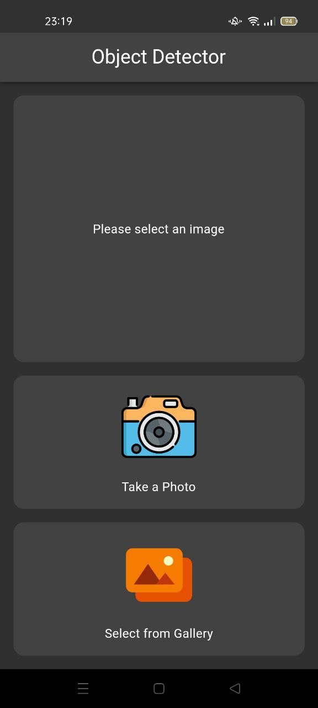
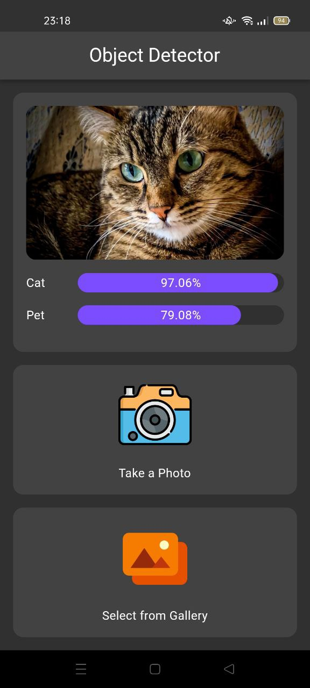
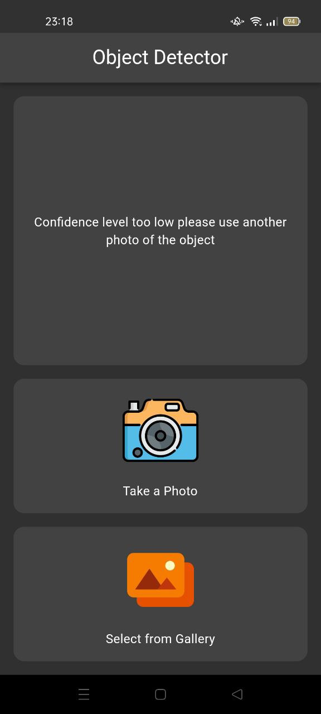

# Object Detection with Google ML Kit

A simple app that demonstrates the use of Google ML Kit in Flutter.

## Preview
<p align='center'>
    
    
    

</p>

##### This project contains generated files. Don't forget to run script below before running the project.
```sh
sh scripts/build_runner.sh
```